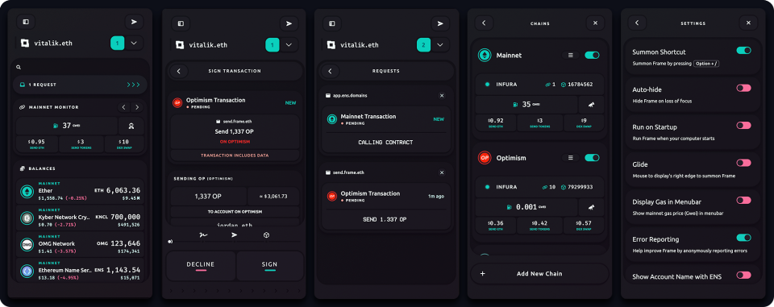

<h2 align="center">
  <br>
  
  <br>
  <br>
  N E W F R A M E
  <br>
  <br>
</h2>
<h3 align="center">System-wide Web3 for macOS, Windows, and Linux</h3>
<br>
<h5 align="center">
  <a href="#features">Features</a> -
  <a href="#download-and-get-started">Download and get started</a> -
  <a href="#project-surfaces">Project surfaces</a>
</h5>
<br>



Newframe is a web3 platform that creates a secure system-wide interface to your chains and accounts. Any browser, command-line, or native application can access web3 through the Newframe desktop app, while the companion browser extension injects a Newframe-connected provider into sites that expect `window.ethereum`.

## Features

- **First-class hardware signer support:** use your GridPlus, Ledger, and Trezor accounts with any dapp.
- **Extensive software signer support:** use a mnemonic phrase, keystore.json, or standalone private keys to create and back up accounts.
- **Permissions:** control which dapps can access Newframe and monitor requests with full transparency.
- **Omnichain routing:** let dapps use multiple chains at the same time for truly multichain experiences.
- **Transaction decoding:** decode calldata with verified contract ABIs so transactions can be reviewed before signing.
- **Custom Ethereum connections:** bring your own RPC endpoints instead of relying on a centralized gateway.
- **Menu bar support:** keep Newframe available without taking over your desktop.
- **Cross-platform desktop app:** run Newframe on macOS, Windows, and Linux.
- **Browser companion extension:** connect Chrome, Brave, Firefox, and other supported browsers to the desktop app.

## Download and get started

### Download the desktop app

- [Production releases](https://github.com/wardenjakx/newframe/releases)
- [Canary releases](https://github.com/wardenjakx/newframe/releases)

After installing, open Newframe from your applications folder or app launcher.

### Run from source

Use Bun to install dependencies, run the desktop app, and build the browser extension:

```bash
git clone https://github.com/wardenjakx/newframe.git
cd newframe
bun --cwd apps/newframe run setup
bun run dev:newframe
```

In another terminal, build the extension:

```bash
bun run build:newframe-extension
```

Load `apps/newframe-extension/dist` as an unpacked extension in Chrome, Brave, or another Chromium-based browser. For Firefox, load `apps/newframe-extension/dist/manifest.json` as a temporary add-on from `about:debugging#/runtime/this-firefox`.

To enable wallet portfolio discovery, add a Zerion API key in Newframe settings and enable token auto-discovery.

## Project surfaces

- [`apps/newframe`](apps/newframe/README.md) - Electron desktop wallet and system-wide provider app.
- [`apps/newframe-extension`](apps/newframe-extension/README.md) - browser companion extension that injects a Newframe-connected provider.
- `packages` - shared libraries used by the app surfaces.
