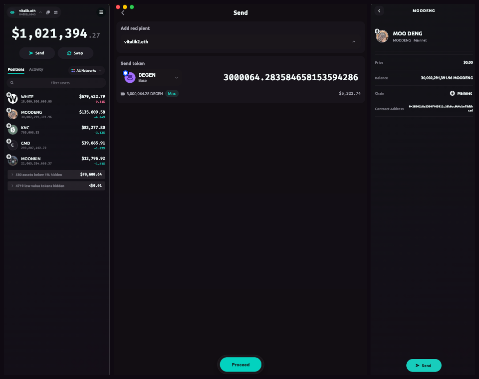

<h2 align="center">
  <br>
  
  <br>
  <br>
  N E W F R A M E
  <br>
  <br>
</h2>
<h3 align="center">The desktop wallet experience you deserve</h3>
<br>
<h5 align="center">
  <a href="#features">Features</a> -
  <a href="#download-and-get-started">Download and get started</a> -
  <a href="#project-surfaces">Project surfaces</a>
</h5>
<br>



Newframe is a web3 platform that creates a secure system-wide interface to your chains and accounts. Any browser, command-line, or native application can access web3 through the Newframe desktop app, while the companion browser extension injects a Newframe-connected provider into sites that expect `window.ethereum`.

## Features

- **First-class hardware signer support:** use your GridPlus, Ledger, and Trezor accounts with any dapp.
- **Extensive software signer support:** use a mnemonic phrase, keystore.json, or standalone private keys to create and back up accounts.
- **Permissions:** control which dapps can access Newframe and monitor requests with full transparency.
- **Omnichain routing:** let dapps use multiple chains at the same time for truly multichain experiences.
- **Transaction decoding:** decode calldata with verified contract ABIs so transactions can be reviewed before signing.
- **Custom Ethereum connections:** bring your own RPC endpoints instead of relying on a centralized gateway.
- **Menu bar support:** keep Newframe available without taking over your desktop.
- **Cross-platform desktop app:** run Newframe on macOS, Windows, and Linux.
- **Browser companion extension:** connect Chrome, Brave, Firefox, and other supported browsers to the desktop app.

## Download and get started

Download artifacts from [GitHub Releases](https://github.com/wardenjakx/newframe/releases). Releases are currently intended for technical preview use:

- The desktop download is an unsigned macOS arm64 DMG for Apple silicon.
- The browser extension is an unpacked developer extension for Chrome 121+, Brave, Chromium, and temporary Firefox sessions. It is not distributed through a browser extension store and does not update automatically.
- The extension requires the Newframe desktop app to be installed, running, and unlocked.

Each downloadable artifact has a matching `.sha256` file. Download both files into the same directory and verify before installing:

```bash
shasum -a 256 -c Newframe-Desktop-<version>-macOS-arm64.dmg.sha256
shasum -a 256 -c Newframe-Browser-Extension-<version>.zip.sha256
```

After dragging Newframe from the DMG into Applications, remove the macOS quarantine attribute so the unsigned app can open:

```bash
xattr -dr com.apple.quarantine "/Applications/Newframe.app"
```

Only run this command after verifying the checksum and confirming that the DMG came from this repository.

For complete installation steps, including macOS Gatekeeper handling and browser-specific loading, see the [desktop app guide](apps/newframe/README.md#install-the-unsigned-macos-arm64-release) and [browser extension guide](apps/newframe-extension/README.md#install-a-release).

### Run from source

Use Bun to install dependencies, run the desktop app, and build the browser extension:

```bash
git clone https://github.com/wardenjakx/newframe.git
cd newframe
bun --cwd apps/newframe run setup
bun run dev:newframe
```

In another terminal, build the extension:

```bash
bun run build:newframe-extension
```

Load `apps/newframe-extension/dist` as an unpacked extension in Chrome, Brave, or another Chromium-based browser. For Firefox, load `apps/newframe-extension/dist/manifest.json` as a temporary add-on from `about:debugging#/runtime/this-firefox`.

To enable wallet portfolio discovery, add a Zerion API key in Newframe settings and enable token auto-discovery.

### Development checks

Run `bun run lint` for Oxlint, `bun run typecheck` for TypeScript 7.0.2, and
`bun run test` for tests. `bun run lint:warn` also shows lint warnings;
`bun run lint:fix` applies fixes. Prettier handles formatting.

Oxlint's native rules cover JavaScript, TypeScript, React, and React Hooks.
Testing Library, React's `no-deprecated` rule, the extension settings' React rules,
and the Hooks `config` and `gating` rules use its JavaScript plugin support, which
is currently alpha. The config preserves the previous rule scopes and ignores.
Lint commands report unused suppression comments as warnings, visible with
`bun run lint:warn` or the application lint commands.

All workspaces depend directly on TypeScript 7.0.2 for builds and typechecks.
Panda CSS installs its own TypeScript 6.0.2 dependency because its config loader
uses compiler APIs such as `resolveModuleName`, which TypeScript 7 does not expose.
Do not override that transitive dependency to TypeScript 7.

## Project surfaces

- [`apps/newframe`](apps/newframe/README.md) - Electron desktop wallet and system-wide provider app.
- [`apps/newframe-extension`](apps/newframe-extension/README.md) - browser companion extension that injects a Newframe-connected provider.
- `packages` - shared libraries used by the app surfaces.
