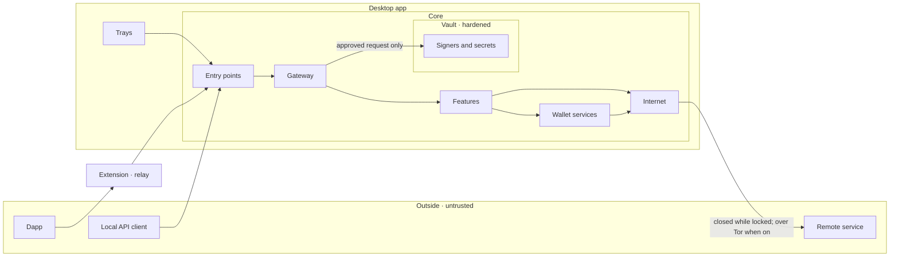
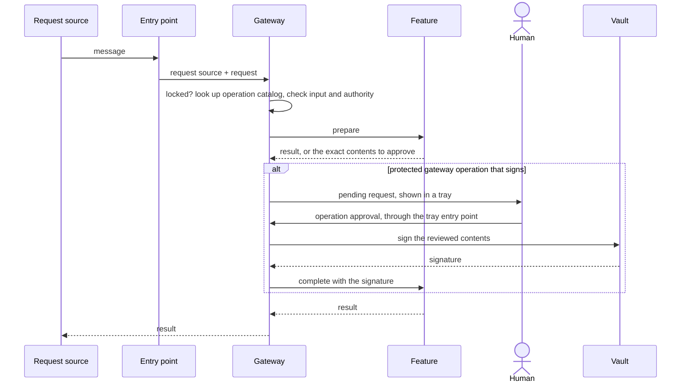

# Target architecture

The endgame structure for Newframe. Every name here is defined in [CONTEXT.md](../CONTEXT.md). This describes where the code is going, not where it is.

## Rules

1. **One owner.** Every piece of state and every kind of decision has exactly one owner. Everything else reads or asks.
2. **One interface.** Each part exposes one narrow interface. Nothing reaches around it.
3. **Validate once, at the boundary.** Data moving into a more trusted zone is validated by that boundary's owner. Code behind the boundary does not re-check it.
4. **Dependencies point inward.** Features know primitives; primitives never know features.
5. **Authority is held, not claimed.** A request source can only be created by an entry point, and only the gateway can reach the vault. Neither can be copied, hand-built, or passed along.
6. **Features compose, primitives enforce.** A feature cannot weaken a boundary because it never holds the thing the boundary protects.
7. **Deny by default.** A gateway operation that is not in the operation catalog, or a request source its entry does not name, is rejected without anyone writing a rule for it.

## Who we defend against

| Attacker                                                                                                                      | In scope | Stance                                                                                                                    |
| ----------------------------------------------------------------------------------------------------------------------------- | -------- | ------------------------------------------------------------------------------------------------------------------------- |
| Malicious dapp                                                                                                                | Yes      | Untrusted before and after it is connected                                                                                |
| Compromised or dishonest remote service                                                                                       | Yes      | Decided per remote service, with the accepted worst case written down below                                               |
| Local API client acting without the human                                                                                     | Yes      | It gets nothing without the human's decision: a prompt per request, or an AI session the human approved                   |
| Malware on the computer: reading or changing Newframe's files, stealing an AI session credential, impersonating the extension | No       | Anything that can do this can also alter the trays or the desktop app itself. We do not design against it                 |
| Compromised tray                                                                                                              | No       | The trays are our code and the human's only channel. The entry point only confirms a message really came from one of them |
| Compromised update                                                                                                            | No       | Automatic updates are off                                                                                                 |

## Trust zones



From least to most trusted: outside, the relay, the trays, the core. The vault is not a separate zone or a separate process; it is the hardened part of the core, reachable only from the gateway. The core is trusted, so the vault's protection is that nothing but the gateway is given its interface.

Data becomes more trusted in two directions: requests coming in, and responses from remote services coming back. Both are boundaries.

| Boundary                   | Owner                                    | Validates, once                                                                                                                                                              | Never does                                                  |
| -------------------------- | ---------------------------------------- | ---------------------------------------------------------------------------------------------------------------------------------------------------------------------------- | ----------------------------------------------------------- |
| Dapp → extension           | Extension                                | Dapp origin, taken from the browser only                                                                                                                                     | Policy, account logic                                       |
| Outside or relay → core    | Entry point                              | Who is on the channel (approved extension, AI session credential, or neither), message size and rate. A client that is neither has no identity: the name it gives is a label | Decide what the request source may do                       |
| Tray → core                | Entry point                              | The message really came from one of our trays, using the identity the desktop framework supplies, not anything the message says                                              | Treat the tray as hostile                                   |
| Request → feature          | Gateway                                  | Not locked; the gateway operation exists; its input is well-formed; the request source holds the authority it needs                                                          | Wallet logic                                                |
| Human decision → signature | Gateway                                  | Decision came from a tray and matches a pending request; only fields that gateway operation allows to be edited differ from what it holds; hands the vault the result        | Let a feature or wallet service reach the vault             |
| Gateway → vault            | Vault                                    | Not locked; account and signer still match; signer ready; the password or biometric is correct when unlocking or password confirmation is required                           | Decide whether a gateway operation is allowed               |
| Remote service → core      | The wallet service or feature that asked | Response shape always; content where that remote service is not trusted for it                                                                                               | Show a remote service's description of what the human signs |
| Disk → core                | State                                    | Stored state is well-formed on load                                                                                                                                          |                                                             |
| Core → tray                | State                                    | Each tray receives only its projection                                                                                                                                       | Send a secret the human did not ask to see                  |

Wallet services and features sit behind all of these. They check meaning (the account exists, the chain is known, the balance covers it) and nothing about identity or authority.

## Parts

Parts are either **primitives**, the shared building blocks every feature relies on and none can bypass, or **features** built on top of them.

| Part                | Kind             | Owns                                                                                                                                                | Interface                                                                     |
| ------------------- | ---------------- | --------------------------------------------------------------------------------------------------------------------------------------------------- | ----------------------------------------------------------------------------- |
| **Entry points**    | Primitive        | Identifying who is on a channel and creating the request source. One each for trays, the extension, other local API clients, and AI session clients | Hands the gateway a request source and a request                              |
| **Gateway**         | Primitive        | The operation catalog, the authority ledger, requests in progress and pending requests. The vault's only caller                                     | Accepts a request from an entry point                                         |
| **Vault**           | Primitive        | Secrets, the lock, signers (hot and hardware wallets), signatures, key export                                                                       | Sign, export, manage signers. Given to the gateway only                       |
| **Wallet services** | Primitive        | One area of wallet state each: chains, accounts, Safe wallets, assets, transactions, settings                                                       | A typed interface per service and a read-only view of its state               |
| **State**           | Primitive        | Storage, loading, and projections. Not the contents: each piece belongs to its owner                                                                | One write handle per piece of state, given to its owner only                  |
| **Internet**        | Primitive        | Every internet request the core makes to a remote service: whether one may leave at all, and how it leaves the computer                             | Send a request, open a socket. Opened and closed by the composition root only |
| **Desktop UI**      | Primitive        | Tray windows, menu bar icon, menus, shortcuts, launch                                                                                               | Window and lifecycle interface                                                |
| **Features**        | Feature          | One user-facing capability each: its gateway operations, its screens, and any state or remote service only it uses                                  | Registered with the gateway; screens shown in a tray                          |
| **Trays**           | Trays            | Showing projections and carrying the human's decisions                                                                                              | Reach the core through the tray entry point only                              |
| **Extension**       | Separate program | Dapp origin, the injected Ethereum provider, the connection to the desktop app                                                                      | Reaches the core through its entry point only                                 |
| **Newframe CLI**    | Separate program | AI session credential storage, its commands, and its own conversation with the trading service                                                      | Reaches the core through the local API only, and only for signatures          |

One file, the composition root, constructs every part of the core and hands each one the interfaces it is allowed. Nothing else wires parts together.

### State ownership

One writer per piece of state. Everything else gets a read-only view.

| State                                                                                                                | Owner                       | Kind      |
| -------------------------------------------------------------------------------------------------------------------- | --------------------------- | --------- |
| Authority ledger: extension approval, extension account access, account access grants, AI sessions; pending requests | Gateway                     | Primitive |
| Key material, lock, signers and their pairing secrets, the human's API keys for remote services                      | Vault                       | Primitive |
| Chains, their node addresses, the selected chain, gas and fee data                                                   | Chains wallet service       | Primitive |
| Accounts, profiles, ordering, selection                                                                              | Accounts wallet service     | Primitive |
| Each Safe wallet's Safe owners, threshold, Safe proposals and confirmations                                          | Safe wallets wallet service | Primitive |
| Tokens, balances, prices, images                                                                                     | Assets wallet service       | Primitive |
| Transaction history                                                                                                  | Transactions wallet service | Primitive |
| Preferences                                                                                                          | Settings wallet service     | Primitive |
| Navigation, notifications, tray placement                                                                            | Desktop UI                  | Primitive |
| Trade quotes and orders                                                                                              | Trading feature             | Feature   |

Feature state is read only by its own feature. A primitive never reads it. Features that own no state (sending, reviewing a dapp's request, the Safe proposal queue, adding an account, managing connected dapps) only call primitives.

Safe wallets are a primitive because the gateway has to know how an account answers a signing request, and a Safe wallet answers differently from every other account.

## Path of a request

Every request, from every request source, takes the same path.



- **One catalog.** Each gateway operation has one entry: its input and result, its authorization policy, and the feature that carries it out. An entry missing any of the three does not compile. Nobody enumerates what is forbidden; whatever the catalog does not allow is rejected.
- **Policy** is two facts per entry: which request sources may ask, and what authority is needed.

  | Authority             | Meaning                                                                          | Example                                  |
  | --------------------- | -------------------------------------------------------------------------------- | ---------------------------------------- |
  | None                  | Any allowed request source may ask                                               | Reading the current chain ID             |
  | Account access grant  | The request source was given this account                                        | A connected dapp reading its accounts    |
  | Operation approval    | The human approved these exact contents, or a live AI session covers them        | Signing a message, sending a transaction |
  | Password confirmation | The human re-entered the password or passed the biometric check for this request | Exporting a private key                  |

- **One lock for everything.** While locked, the gateway admits nothing from any request source except unlocking, the vault releases nothing, the internet is closed, and AI sessions are paused. A connected dapp gets no accounts, no events, and no chain reads. Newframe locks when the human locks it and when the computer's screen locks or it sleeps, so there is no separate suspended state to manage.
- **Closing the internet is the guarantee, not each caller's memory.** While closed, the internet refuses every new internet request to a remote service, so a poller that forgot to stop still reaches nothing. An internet request already sent is left to finish, so a send with effect is never cut off halfway and left in an unknown state. Background work follows the internet's state, never the lock directly, and closes its own timers and sockets when it closes. The internet starts closed and opens only once stored state has loaded and its route is ready, so nothing connects before the human's settings are known, and with Tor on nothing connects until Tor has.
- **Requests can be long.** Pairing a hardware wallet or waiting on the human can take minutes. It is still one request: its progress is part of the projection, and cancelling it is another request. There is no separate kind of background work.
- **Password confirmation is checked by the vault.** The gateway's policy says a gateway operation needs it; the vault is what verifies the password or biometric, since that is what unlocks the secret.
- **Two decisions, two times.** Admission: may this request source request this gateway operation? Approval: did the human agree to these exact contents? Most gateway operations need only the first.
- **Only the gateway reaches the vault.** A feature prepares what should be signed and receives the signature afterwards; it cannot ask for one. Everything between admission and signing is ordinary feature and wallet service code, and none of it can sign by mistake.
- **Safe wallets.** A request source granted a Safe wallet sees one account. It is not told that the account is a Safe wallet or who its Safe owners are, and the grant gives it no access to them. When a request for the Safe wallet is approved, the gateway has it signed by the Safe owners that are accounts in the active profile.
- **AI sessions.** A request within an AI session's scope is approved without a prompt. The session stays bound to its account: changing the selected account does not redirect it. It is paused while a different profile is active, so its activity is never mixed with another profile's. Revoking the session or removing the account cancels requests in flight. The vault sees no difference. Within its account and duration an AI session can have anything signed that the account can sign, including things that outlive the session: a token allowance, a signed permit, a standing order, or a confirmation as a Safe owner. It can never reach a gateway operation that reveals a secret or changes authority; those are open to trays only.
- **Secrets are decrypted only for the moment of use.** Unlocking gives the vault one key, held in memory until the lock. Every other secret stays encrypted: the vault decrypts an account's key to sign or export, and holds no decrypted copy afterwards. After a key export the only remaining copy is what the tray is showing.
- **Edits during review stay in the tray.** While the human adjusts fees, the nonce, or a token allowance, nothing is sent to the core. The approval carries the final values of the fields that gateway operation allows to be edited; the gateway applies them to the contents it holds, refuses any other change, and has the result signed. The core may refresh a pending request's fees in the background; the tray shows the newer fees unless the human has already set their own.
- **Input during signing.** A hardware wallet may need a PIN, a passphrase, or a scanned code part-way through. The vault never asks a tray for it. What it is waiting for appears in the projection, and the human's answer arrives as a request from a tray like any other.
- **Recheck on release.** Signing can take minutes on a hardware wallet. The lock, the account, the profile, and the approval are checked again when the signature comes back, before it is released.
- **Message formats are not operations.** Outside clients speak Ethereum JSON-RPC; the extension, the Newframe CLI and trays use typed messages. Each entry point translates its format into requests. Wrapper methods are unwrapped before the catalog lookup, and only catalogued reads are forwarded to a chain.
- **Events follow the same policy as reads.** When accounts or chains change, the gateway decides which request sources are told, by the same authority it would require for them to ask. Nothing else pushes to a request source.
- **No private path.** A feature that needs a signature for its own flow submits a request like any other request source.

## Remote services

A remote service is not a step in the path; it is whatever is on the other end. The wallet service or feature that needs it is the only part that talks to it, and it does so only through the internet.

The internet decides two things for every internet request: whether it may leave at all, which it may not while locked, and how it leaves the computer. With Tor on, the internet sends every internet request through the bundled Tor client: HTTP through Chromium's SOCKS proxy, sockets through a SOCKS agent, and names resolve inside Tor. If Tor is not connected the internet stays closed; it never falls back to a direct connection. Whether Tor is on is a saved setting that applies at the next launch, defaulting to the build's `NEWFRAME_TOR_ENABLED` (off unless set true). A connection to this computer (loopback) never reaches the internet, so it is let through even while closed.

The gateway does not guard internet requests. It decides whether a request source may request a gateway operation; what that operation reaches out to is internal. Three things cross this edge:

| What crosses                                                                                    | Risk                                                                                                   | Rule                                                                                                                                                                                                |
| ----------------------------------------------------------------------------------------------- | ------------------------------------------------------------------------------------------------------ | --------------------------------------------------------------------------------------------------------------------------------------------------------------------------------------------------- |
| Reads going out: balances, prices, chain state, Safe proposals                                  | The remote service learns the human's addresses and IP address, and can link accounts queried together | Inside the core, each remote service is contacted by one owner, which sends it only accounts in the active profile that it needs                                                                    |
| Sends with effect: broadcasting a transaction, submitting a Safe confirmation, placing an order | Irreversible; can move the human's funds                                                               | Only as the completion of an approved request. Nothing sends on its own initiative. The one exception is passing on a transaction the request source signed itself, which uses no authority of ours |
| Responses coming back                                                                           | The remote service is wrong or compromised                                                             | Every response is checked for shape. Whether its content is re-verified is decided per remote service                                                                                               |

How far a response is trusted is decided once per remote service and recorded here, with the worst case we accept, so it is not re-argued in each feature:

| Remote service               | Trusted for                                                              | Worst case if compromised                                                                                                                 | Protection                                                                                                                                                                                                          | What we accept, and why                                                                                                              |
| ---------------------------- | ------------------------------------------------------------------------ | ----------------------------------------------------------------------------------------------------------------------------------------- | ------------------------------------------------------------------------------------------------------------------------------------------------------------------------------------------------------------------- | ------------------------------------------------------------------------------------------------------------------------------------ |
| Chain node                   | Chain state, balances, simulation, name resolution                       | False balances; a false simulation makes a harmful transaction look harmless; a name resolved to the wrong address; transactions withheld | What is signed is shown from the bytes. The node is built in or approved by the human, and must report the expected chain ID                                                                                        | Chain state is not checked against a second source. Doing so needs a second node or a light client for every read                    |
| Trading service              | Balances, prices, quotes, order status                                   | False balances or prices; a poor quote; a harmful item handed back for signing                                                            | Items it hands back for signing are reviewed from their bytes, like a dapp's                                                                                                                                        | Balances are not re-read from the chain, which would take one call per asset. Quote fairness is trusted                              |
| Portfolio and price sources  | Balances and prices, for display                                         | False balances or values; invented or hidden tokens                                                                                       | Display only. Never an input to what is signed                                                                                                                                                                      | No verification. A wrong display misleads but moves nothing                                                                          |
| Safe transaction service     | Nothing. It is the least trusted remote service                          | An altered Safe proposal that a Safe owner confirms, losing funds. This has happened to Safe wallet users                                 | Everything it returns is rebuilt locally: the hash is recomputed, the call data decoded from the bytes, and other Safe owners' confirmations checked against that hash. Matched, mismatch, or not verified is shown | Only what cannot be checked from outside: it can hide or delay a Safe proposal. Nothing about a Safe proposal's contents is accepted |
| Contract description sources | Supplying a description to try                                           | A misleading description of what a call does                                                                                              | A decoding must re-encode to the same bytes                                                                                                                                                                         | Function and field names can still mislead while the values are right                                                                |
| Icon and image sources       | Pictures of tokens and chains                                            | A misleading or offensive picture; the source learns which tokens are held                                                                | Fetched by the core, stored, and shown from the stored copy. A tray never loads a remote picture itself                                                                                                             | No verification. A picture is never evidence of what a token is                                                                      |
| Hardware wallet relay        | Carrying messages to a hardware wallet that is reached over the internet | It can refuse or delay. It sees that a device is in use                                                                                   | The device signs, not the relay, and the human confirms on the device. The vault is the only part that talks to it                                                                                                  | The relay's availability. Its address can be changed by the human only                                                               |

Two rules hold regardless of trust:

- **Labels for review ship with Newframe.** The clear-signing descriptions that say how to label and format a message are part of the source, fixed at each release. They are not fetched while Newframe runs, so nobody outside can change what a review screen says.
- **What the human signs is shown from the bytes.** A remote service can hand Newframe something to sign: the trading service returns the token approval and order for a quote, the Safe transaction service returns a Safe proposal. The review screen works out what that item does from its own bytes (which token, how much, to whom), the same as for a dapp's request. The remote service's own summary of it is never what the human approves. A wrong balance misleads; a wrong signing screen loses funds.
- **Three outcomes, each shown to the human.** A check that is required ends as matched, mismatch, or not verified. Mismatch means the check ran and found a disagreement, which is evidence of tampering. Not verified means the check could not run: an unsupported Safe wallet version, a missing field, an unreachable node. The human is told which, with the reason. Folding not verified into mismatch would raise the tampering alarm for routine gaps until it is ignored; folding it into matched would hide the gap.

Wallet services also read on their own schedule, without a request: balances, prices, fees, transaction status, the Safe proposal queue, order status. This background refresh only ever reads, only for the selected account, and stops while locked. It follows the same rules as any other read.

The Newframe CLI is a separate program and talks to the trading service itself, using the same shared client as the trading feature, so that getting a quote does not need the desktop app. It comes to the core only to have something signed under its AI session. While an AI session is open the trading feature keeps a live connection to the trading service, so orders the Newframe CLI places appear in the trays as they change.

A dapp can ask Newframe to start using a remote service the human never chose, by supplying a node address when it asks to add a chain. That node would then see the human's addresses and answer every read for that chain. So a dapp-supplied address is not contacted until the human approves the request that adds it, and a node is kept only if it reports the expected chain ID. The same request can carry a block explorer address, the website Newframe later opens when the human asks to view a transaction; it is shown in that approval too.

## Layout

The desktop app has two halves, matching the trust zones: everything that is not a tray is the core.

```
packages/
  schema/        message and state shapes shared by both sides of a boundary
  ui/            design system
  flash/         client for the trading service
apps/
  desktop/src/
    core/
      main.ts      composition root
      entry/       tray/  extension/  local-api/  ai-session/
      gateway/     operation catalog policy, authority ledger, pending requests
      vault/       secrets, lock, signers/
      services/    chains/  accounts/  safe-wallets/  assets/  transactions/  settings/
      features/    trading/  send/  dapp-requests/  safe-proposals/  connected-dapps/  onboarding/  ...
      state/       storage, projections
      internet/    the only way out to remote services
      desktop-ui/  tray windows, menu bar icon, menus, shortcuts
    trays/
      main/        main tray root
      side/        side tray root
      features/    one folder of screens per feature, named as in core/features
  extension/src/ page/  content/  background/  settings/
  cli/
harness/         end-to-end and visual checks against the built app
```

`packages/schema` is not a part and owns no behaviour. It exists so the two sides of a boundary (extension and desktop app, Newframe CLI and desktop app, tray and core) share one definition of each message instead of two that can drift, and so the trays have something to import that is not the core.

Allowed imports, enforced by the compiler through package boundaries rather than a script:

```
schema ← core: { gateway, vault, state, internet, services, desktop-ui } ← features ← main.ts
    ↑
core/entry, trays, extension, cli
```

- `trays` imports only `schema` and `ui`, never `core`. `core` never imports `trays`.
- `entry`, `gateway` and `vault` are small, slow-changing and security-reviewed. Creating a request source is exported only to `entry`; the vault's interface is exported only to `gateway`.
- A wallet service never imports `gateway`, `entry` or a feature. It imports another wallet service only if that one comes earlier in the order chains → accounts → Safe wallets → assets → transactions.
- Features never import each other. A flow that spans two features goes through gateway operations.
- Only `vault` imports key and hardware-wallet libraries, including the client for a hardware wallet relay. Only the owner of a remote service's data imports that remote service's client.
- Only `internet` opens a connection. `fetch`, `WebSocket` and Electron's `net` are lint errors everywhere else in the core; a remote service's client is handed the internet's request function instead of reaching for its own. Libraries can't be linted, so the main process also makes the internet Node's global `fetch` and default http(s) agents: a library that uses them, such as a hardware wallet SDK, follows the lock and route without knowing.

## Adding a feature

1. Add its gateway operations to the operation catalog: input, result, and policy. The policy is the security review.
2. Write the feature: what carries out each gateway operation in `core/features/<name>`, its screens in `trays/features/<name>`, and any state only it uses.
3. If it needs new shared wallet state, add that to the owning wallet service.

No entry point, the vault, or another feature changes.

## Tests

Each boundary above is tested in one place, by sending input across it for real, with the core assembled and unmodified and everything outside it replaced by a virtual service. See [testing.md](testing.md).

## Behaviour that changes

Most of the endgame is restructuring. These change what Newframe does:

| Today                                                                                                                                                                                       | Endgame                                                                                                                                                                                                                                                           |
| ------------------------------------------------------------------------------------------------------------------------------------------------------------------------------------------- | ----------------------------------------------------------------------------------------------------------------------------------------------------------------------------------------------------------------------------------------------------------------- |
| The gateway refuses dapp and AI-session requests while locked, but a tray's requests and the extension's own requests are not checked, and events are still pushed to dapps                 | While locked the gateway admits nothing except unlocking                                                                                                                                                                                                          |
| A library that dials its own sockets or brings its own http agent still bypasses the internet                                                                                               | Every connection the desktop app opens goes through the internet, so the lock and routing apply to it                                                                                                                                                             |
| Whether key export asks for the password again is not confirmed                                                                                                                             | Revealing a secret always needs password confirmation. Resetting the wallet and adding a hot wallet do not                                                                                                                                                        |
| A hardware wallet pairing secret sits in general stored state; the portfolio API key sits in settings                                                                                       | Every secret is held by the vault, encrypted, and decrypted only for the moment of use                                                                                                                                                                            |
| Events to dapps are sent from the code that carries out requests                                                                                                                            | The gateway decides who is told                                                                                                                                                                                                                                   |
| Each dapp has its own selected chain                                                                                                                                                        | One selected chain for the whole desktop app. A dapp's request to switch it is a pending request the human approves; a switch the human makes in the extension's own panel applies at once. Every connected dapp is told when it changes                          |
| Clear-signing descriptions are downloaded while running, from the live branch of a public repository                                                                                        | A copy is kept in the source and updated only by a release                                                                                                                                                                                                        |
| Each edit during review (fees, nonce, token allowance) is sent to the core as it is made, and the core tracks whether the human has set fees                                                | Edits stay in the tray. The approval carries the final values of the editable fields                                                                                                                                                                              |
| Local API messages are named after the project Newframe was forked from (`frame_*`, `__frame*`)                                                                                             | Named to match the glossary                                                                                                                                                                                                                                       |
| A tray is allowed to connect to any address                                                                                                                                                 | A tray connects to nothing but the core                                                                                                                                                                                                                           |
| Secrets are kept in three places: the vault file, a signers folder, and general stored state                                                                                                | One store, owned by the vault                                                                                                                                                                                                                                     |
| Switches that exist for tests live in the core: one exposes all state to the visual harness, others move the local API and point at virtual services                                        | One setting at the composition root for pointing the core at virtual services, available only in a development profile                                                                                                                                            |
| A Safe proposal's contents are re-verified, but the confirmations on it are shown as the Safe transaction service reports them. The count can be false; the contents the human signs cannot | Each confirmation is checked against the recomputed hash and the Safe wallet's owners read from the chain. A plain signature is checked locally; a contract owner's or a pre-approved one needs a chain read. One that cannot be checked is shown as not verified |
| The extension has its own selected account, and the desktop app switches to it before prompting                                                                                             | There is one selected account. The extension acts as it when it is shared with the extension, and otherwise has no account. The extension's picker offers the accounts shared with it, and choosing one changes the selected account in the desktop app           |

## Where today's code lands

| Today                                                                                                                                                                     | Endgame                                                              |
| ------------------------------------------------------------------------------------------------------------------------------------------------------------------------- | -------------------------------------------------------------------- |
| `app/contracts`, `packages/desktop-api`, feature `contract/`, `platform/ipc/contract`, projection contracts                                                               | `packages/schema`                                                    |
| `app/main/gateway`, `features/connections/main/origins` and extension access, request storage inside `features/accounts`, `features/requests/main`, `platform/operations` | `core/gateway`                                                       |
| `app/main/protected-operations`, `platform/signing`, `platform/secrets`, `features/security/main`                                                                         | `core/vault`                                                         |
| `app/main/ipc-handlers` (2,700 lines), `features/connections/main/provider`                                                                                               | Split across `core/features/*`                                       |
| `features/accounts/main/index.ts` (2,600 lines: accounts, requests, signing, fees, history)                                                                               | `core/services/accounts` plus pieces to gateway, vault, transactions |
| `platform/safe`, `features/accounts/main/safe*`                                                                                                                           | `core/services/safe-wallets`                                         |
| `features/asset-data`, `features/tokens`, `features/portfolio`                                                                                                            | `core/services/assets`                                               |
| `features/transactions/trade`                                                                                                                                             | `core/features/trading`                                              |
| `platform/state-store` (one store, about 100 mutators open to every holder), `platform/state-sync`, `platform/persistence`                                                | `core/state`, with each piece owned as above                         |
| `platform/desktop`, `platform/app-update`, `platform/runtime`                                                                                                             | `core/desktop-ui`                                                    |
| `app/renderer`, every `features/*/renderer`, `shared/renderer`                                                                                                            | `trays`                                                              |
| `scripts/check-architecture.ts`                                                                                                                                           | Deleted as each rule becomes a compile error                         |

## Names in the code today

The code predates the glossary. Counts are occurrences outside tests.

| Glossary term           | Code says                                                  | Occurrences |
| ----------------------- | ---------------------------------------------------------- | ----------- |
| Tray, main tray         | `renderer` in folder, tsconfig and script names            | About 450   |
| AI session              | `agentEnabled`, the stored account flag                    | 18          |
| Request                 | `handlerId`, the stored key on activity records and grants | 12          |
| Account access grant    | `permissions`, the stored key                              | 36          |
| Request source          | `origin` for any request source, not just dapps            | About 1,200 |
| Local API message names | `frame_*`, `__frame*`, the `agent` route and header        | 65          |
