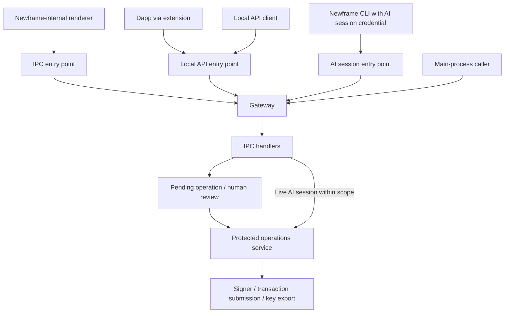
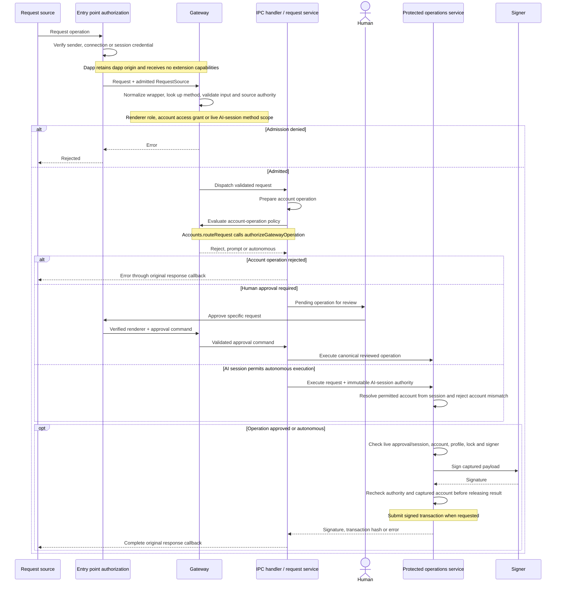

# Request boundaries

The names below follow [CONTEXT.md](../CONTEXT.md). Application code lives under `apps/newframe/src`.

## Architecture terms

**Entry point authorization layer**:
The desktop app's transport-facing boundary for an incoming request. It admits the connection or sender, carries source evidence such as a browser-derived dapp origin into main, and passes the request to the Gateway; it does not decide whether the requested operation is allowed. It refuses browser pages that call the local API directly; the only browser connection it admits is the extension's.

**Newframe-internal request**:
A request initiated by Newframe's own renderer. Verifying the renderer as the source is distinct from approving a specific operation as a human.

**Main-process caller**:
A Newframe feature running in desktop main that requests a gateway operation directly. It is distinct from a Newframe-internal renderer request and still subject to gateway policy.

**IPC handler**:
The main-process handler that performs an operation admitted by the Gateway. It can finish the work directly or create a pending operation for human review before calling a protected service.

**Protected operations service**:
The single main-process service for highest-sensitivity effects, including approved transaction signing or submission and private-key decryption or export; protected reads need not use it. It is a logical service inside Electron main, not a separate operating-system process.

## Flow

| Responsibility                                                                                                        | Owner                                                                                   |
| --------------------------------------------------------------------------------------------------------------------- | --------------------------------------------------------------------------------------- |
| Verify renderer frame and window; admit local connections and extension identity; authenticate AI session credentials | `platform/ipc/main/operations.ts`, `platform/local-rpc/`, `features/agent-access/main/` |
| Issue immutable request sources; distinguish participant from AI session authority                                    | `app/main/gateway/requestSource.ts`                                                     |
| Shared parse → authorize → handle → result validation sequence                                                        | `app/main/gateway/dispatch.ts`                                                          |
| Renderer role/entrypoint policy and operation contracts                                                               | `app/main/gateway/renderer.ts`, `app/contracts/operations.ts`                           |
| Account access grants and AI session method admission                                                                 | `app/main/gateway/rpc.ts`, `rpcPolicy.ts`                                               |
| Extension-owned controls                                                                                              | `app/main/gateway/extension.ts`                                                         |
| Prompt versus autonomous account-operation policy                                                                     | `authorizeGatewayOperation` in `app/main/gateway/requestSource.ts`                      |
| Renderer and RPC application dispatch                                                                                 | `app/main/ipc-handlers/`                                                                |
| Approved signing, autonomous signing, transaction submission and key export                                           | `app/main/protected-operations/`                                                        |

## Authority flow

Entry points derive source evidence from their transport. Request payloads cannot mint request sources: admission requires the original object registered by a source factory. Copies and deserialized snapshots have no authority.

A relayed request retains the dapp as its participant and carries its browser-derived dapp origin. It receives no extension-owned capabilities. Connecting an extension, granting account access, and approving a signing operation remain separate decisions.

Renderer commands and JSON-RPC requests retain their existing wire formats. They share the admission dispatcher while keeping their own contracts and policies. Main-process compositions use the RPC Gateway too. `rpcPolicy.ts` explicitly registers each supported JSON-RPC method, its parameter schema, authorization policy, destination, and AI-session eligibility. Unknown methods return `-32601` and invalid parameters return `-32602`. Wrapped `wallet_request` and `caip_request` calls are normalized before the inner method is checked; wrappers cannot bypass admission. Only registered chain methods can reach a chain node. Public chain reads can proceed without account authority; account operations require an admitted source.

Ordinary signing requests create pending operations for review. An AI session carries its immutable permitted account throughout execution. Protected signing resolves the account from that session, rejects any requested account mismatch, and rechecks session liveness and account availability before releasing a signature or broadcasting a transaction. Switching the UI selection from account A to B does not redirect an A-authorized session: it still signs with A. Revocation or removal/replacement of the captured account cancels pending execution.

IPC handlers prepare work and coordinate feature services. The protected operations service owns sensitive effects. Its account-scoped signing executor checks approval/session liveness, profile, lock, account identity, signer readiness, and cancellation before releasing a result. Private-key export checks account authority before and after asynchronous decryption. Account and onboarding services no longer own raw signing execution or private-key export respectively.

Existing serialized request-authorization snapshots retain the `principal` field and `renderer` / `rpc` / `agent` / `main` kinds for compatibility. These snapshots record decisions; they cannot be used as live request sources. The runtime `participant` field distinguishes the requester, and `aiSession` carries delegated authority.

## Signing sequence

This sequence shows prompted signing and autonomous AI-session signing. Ordinary reads can return from the IPC handler without entering protected signing. Main-process callers enter the Gateway directly with a main-process request source.

Private-key export uses the renderer Gateway and protected operations service too, with account/profile/lock checks before and after decryption. It keeps its existing export flow rather than using the pending-signature approval flow shown above.

## Verification

Gateway tests cover source copies, stale sessions, account grants, extension/dapp separation, unknown methods (including wrapped calls), malformed parameters, main-only simulation methods, and single callback completion. Protected AI-signing tests cover account mismatches, UI selection changes, account replacement, and revocation for messages, typed data, and transactions. Signing and key-export tests exercise authority changes during execution. Architecture checks restrict source issuance and raw signer invocation to their owners and reject operation authorization/effects in transport adapters.

Run `bun run test`, `bun run typecheck`, `bun run lint`, and `bun run knip`. `bun run visual:harness:newframe` exercises the desktop against local chain and service fixtures, including prompted and AI-session operations. Its artifacts are written to `/tmp/newframe-visual-harness`.
